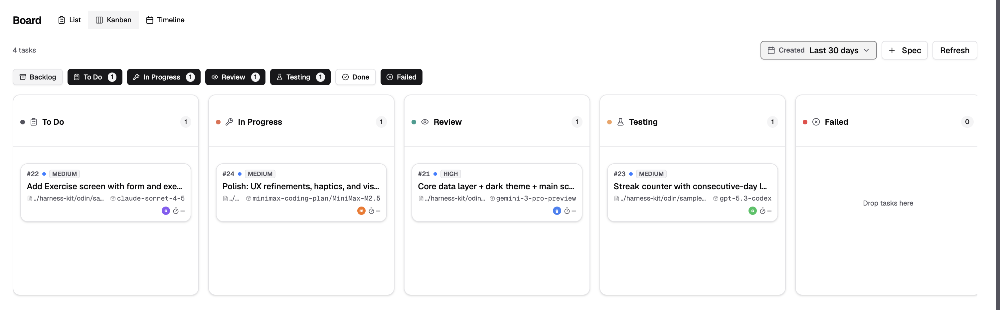
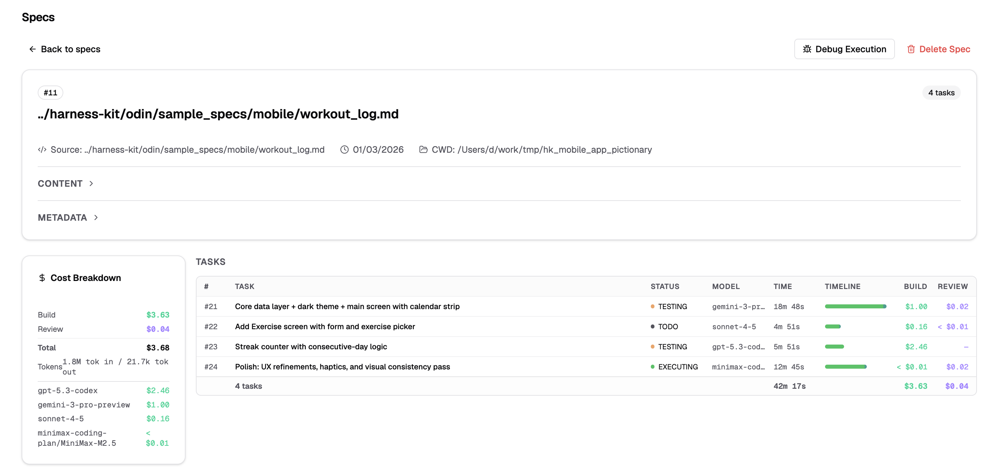
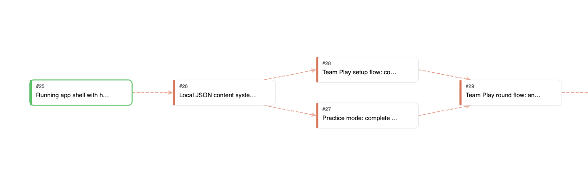

# Harness Kit

**Harness Kit is an open-source harness-engineering toolkit for building software with AI coding agents** — a multi-agent orchestration CLI (odin), a task board with proof-of-work (taskit), and a set of engineering patterns we call **Pattern Engineering**: TDD-first execution, structured root-cause analysis, knowledge compounding, and cost-aware delegation. Work runs as a dependency graph across whichever agents you have (Claude, Codex, GLM, MiniMax, and more), and every task carries its evidence on the board.

https://github.com/user-attachments/assets/52352361-99ed-4c07-83c8-a28dc3b3ba5c

## Pattern Engineering Quickstart

You don't have to install anything to get value from this repo. Point your coding agent (Claude Code, Codex, Cursor — any of them) at the Quickstart and it will audit your repo, score it, and adopt the practices you approve:

```bash
# from your project directory
git clone https://github.com/deepklarity/harness-kit.git ../harness-kit
```

Then paste this into your agent:

```text
Read ../harness-kit/docs/Quickstart.md and follow it: audit this repo,
show me the scored report, and adopt what I approve.
```

The agent runs a read-only audit across eleven areas (agent entrypoints, testing discipline, knowledge compounding, verify gates, …), writes a scored report you can read in two minutes, and waits for your yes/no on each adoption. Full flow: [`docs/Quickstart.md`](docs/Quickstart.md).

## Run the full kit

The board, the orchestrator, and the sandbox — a fresh clone to a merged sample task in about ten minutes:

```bash
git clone https://github.com/deepklarity/harness-kit.git
cd harness-kit
./dev.sh          # backend :9100, dashboard :9200, workers
```

Then follow [`QUICKSTART.md`](QUICKSTART.md) — it checks your provider with `odin doctor` and runs a small spec end to end: plan → sandbox → review → merge. Full guided tour of the UI: [`docs/walkthrough.md`](docs/walkthrough.md).

**Status: experimental.** We ship with it daily, and edges are rough. Platform notes and known gaps are in [`docs/guides/forkd-setup.md`](docs/guides/forkd-setup.md) and each project's README — read those before filing an issue.

## What it looks like


*Board — drag-and-drop kanban with agent assignments*


*Spec run — cost per agent, task timeline, proof of work*


*DAG view — tasks decomposed into dependency waves*

## What's inside

| Directory | What it does |
| :--- | :--- |
| [`odin/`](odin/README.md) | CLI for multi-agent orchestration — plan, assign, execute, reflect |
| [`taskit/`](taskit/README.md) | Task board UI + API — kanban, DAG view, timeline, cost analytics |
| [`harness_usage_status/`](harness_usage_status/README.md) | CLI to check AI provider quotas |
| [`.claude/skills/`](docs/_INDEX.md) | Portable skills: RCA, compounding, mock-first, audits — usable in any repo |
| [`docs/`](docs/_INDEX.md) | Patterns, testing process, flow traces, adoption checklist |

## How it works

- **Everything is a task.** Work decomposes into a dependency graph; independent tasks run in parallel, dependent ones wait. Assembly, review, and testing are tasks too — no hardcoded stages.
- **Cheapest capable agent.** The planner suggests assignments from cost, quota, and capability. You override when you want.
- **Proof of work.** Every task carries evidence: agent output, screenshots, cost, duration. The board is the audit trail.
- **Reflection loops.** Plan → execute → review → adjust. A reviewer model checks work before it merges; failures get root-caused, not retried blindly.
- **Agents ask, humans decide.** When an agent is unsure it asks a question on the board and waits, instead of guessing.
- **Provider agnostic.** Agents are swappable behind a harness interface.

The 20 tenets behind these choices: [`odin/docs/philosophy.md`](odin/docs/philosophy.md).

## What is Pattern Engineering?

Our methodology inside harness engineering: instead of one-off prompts, encode the engineering discipline around agents as reusable, compounding patterns. Where context engineering shapes what a model sees and spec-driven development shapes what it builds, Pattern Engineering shapes **how the work is engineered** — and makes each run improve the next.

| Pattern | What it encodes |
| :--- | :--- |
| **Red/green TDD** | Test-writing agents get only behavioral requirements, never implementation. Tests must fail before implementation starts — the boundary is structural. |
| **Mock-first development** | Mock the UI, get human acceptance, then deepen layer by layer. |
| **Structured RCA** | Reproduce → locate → hypothesis → failing test → fix → verify → document. No jumping to fixes. |
| **Knowledge compounding** | Every solved problem becomes a searchable pattern doc; every debugging session can become a flow trace. Agents search these before re-exploring. |
| **Loop and slop audits** | Can an agent debug this area alone? Is the codebase clean? Scheduled checks with scored reports. |

These live as skills in `.claude/skills/` and transfer to any repo — that's what the [Pattern Engineering Quickstart](#pattern-engineering-quickstart) installs.

## FAQ

**How is this different from Spec Kit or spec-driven development?**
Spec-driven development covers writing the spec. Harness Kit covers what happens after: decomposing the spec into a task graph, routing tasks to the cheapest capable agent, sandboxed execution, review, merge, and the evidence trail — plus the patterns that make the next spec cheaper.

**Do I need the whole kit?**
No. The patterns and skills adopt into any repo via the Quickstart with nothing installed. The board + orchestrator are the optional second step.

**Which agents does it work with?**
Claude Code, Codex, GLM and MiniMax (via opencode), and others behind a common harness interface. One authenticated provider is enough to start.

**Is my code sent anywhere?**
Only to the AI providers you configure. The kit itself runs locally: SQLite, local services, sandboxed task execution in microVMs.

## Motivation

Most AI tooling is one-shot: you prompt, you get output, nothing accumulates. We built Harness Kit so work accumulates — spec runs produce reflections, debugging becomes searchable traces, solved problems compound into patterns. The system gets better because the context gets richer, not just because models do.

Code is ephemeral here: fork it, rewrite it, build your own. The value is in the patterns and the orchestration. And spend your time on the spec — the system is only as good as what you feed it.

## Resources

Writing that shaped this kit: [Agentic Engineering Patterns](https://simonwillison.net/guides/agentic-engineering-patterns/) (Simon Willison), [Understanding is the new bottleneck](https://www.geoffreylitt.com/2026/07/02/understanding-is-the-new-bottleneck.html) (Geoffrey Litt), [The unreasonable effectiveness of HTML](https://claude.com/blog/using-claude-code-the-unreasonable-effectiveness-of-html) (Anthropic), [Compound Engineering Plugin](https://github.com/EveryInc/compound-engineering-plugin), [StrongDM Software Factory](https://factory.strongdm.ai/).

## Roadmap

The living roadmap, scorecard, and backlog are in [`docs/fable_roadmap/`](docs/fable_roadmap/fable_roadmap.md) — the kit plans and builds itself through its own board, and grades itself against [`SCORECARD.md`](docs/fable_roadmap/SCORECARD.md). Near-term focus: onboarding and getting-started, a rethought human inbox, scheduled self-audits, running on more machines.

---

Built by [deepklarity.ai](https://deepklarity.ai). [MIT licensed](LICENSE). Contributions and issue reports welcome — and try other tools too; this is one approach that works for us, not the One True Way.
