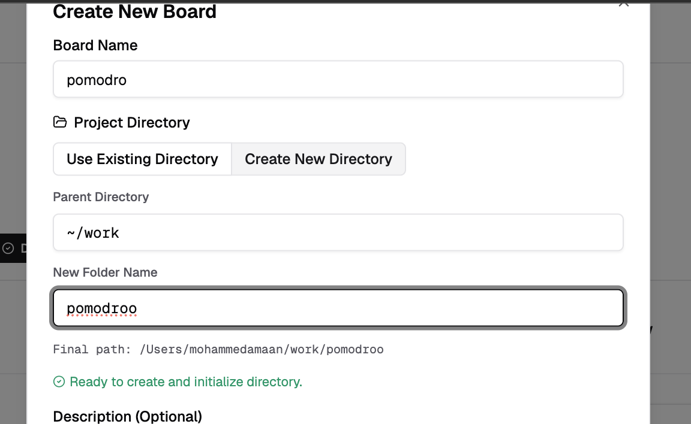
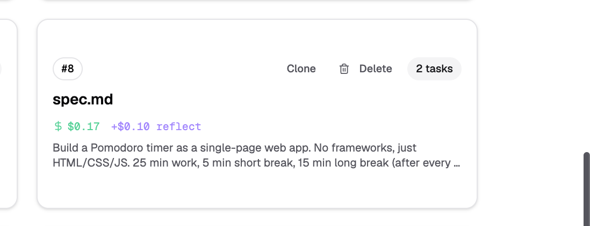
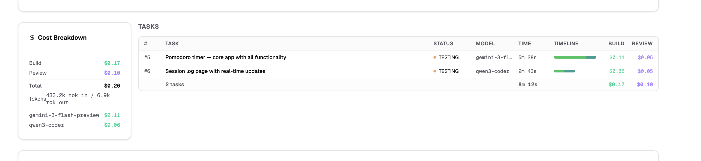
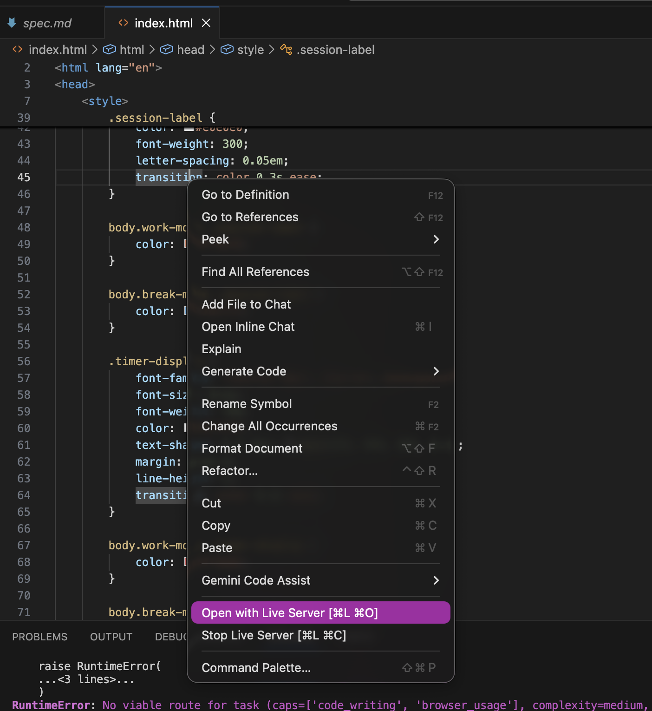
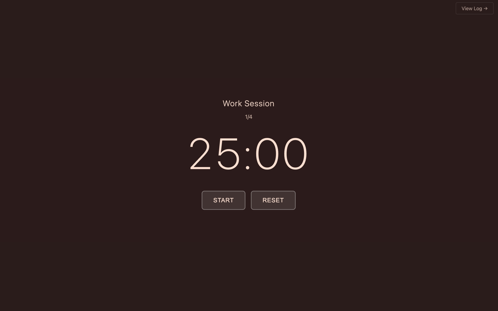

# Harness Kit — Walkthrough

> **Human + AI task orchestration that compounds.**
> A kit for building with AI agents — orchestration, TDD-first execution, structured debugging, knowledge compounding, and cost-aware delegation. Each run makes the next one better.

---

## Table of Contents

1. [Prerequisites](#1-prerequisites)
2. [Clone the Repository](#2-clone-the-repository)
3. [Run Local Setup](#3-run-local-setup)
4. [Create Your First Board](#4-create-your-first-board)
5. [Create Your First Spec](#5-create-your-first-spec)
6. [Generate Tasks with Odin](#6-generate-tasks-with-odin)
7. [Monitor Task Execution](#7-monitor-task-execution)
8. [Spec Details](#8-spec-details)
9. [View Generated Output](#9-view-generated-output)
10. [Troubleshooting](#10-troubleshooting)

---

## 1. Prerequisites

| Requirement | Version | Notes |
|-------------|---------|-------|
| Git | any | |
| Python | 3.10+ | |
| Node.js | 18+ | |
| Claude Code or Codex | latest | At least one AI agent must be installed |

> **No AI agent = Odin won't run.** Install Claude Code CLI at [claude.ai/code](https://claude.ai/code) before continuing.

---

## 2. Clone the Repository

```bash
git clone https://github.com/deepklarity/harness-kit.git
cd harness-kit
```

---

## 3. Run Local Setup

From the **root of the `harness-kit` repository**, start all services:

```bash
./dev.sh
```

Wait until you see this line in the terminal:

```
→ Open http://localhost:5173
```

That means all three services started successfully:

| Service | Port |
|---------|------|
| Django backend | 8000 |
| React frontend | 5173 |
| Celery worker | — (async task execution) |

> `./dev.sh` stays running in the foreground. **Open a new terminal** for the next step.

### Install the Odin CLI

In the new terminal, navigate into the `odin` directory inside your clone:

**Recommended (if you have `pipx`):**

```bash
cd /path/to/harness-kit/odin
pipx install -e .
```

If you don't have `pipx`, install it first:
- **macOS:** `brew install pipx`
- **Ubuntu/Debian:** `sudo apt install pipx`
- **Windows:** `pip install pipx` (then add `~/.local/bin` to your PATH)

**Alternative (using `pip`, no extra tools needed):**

```bash
cd /path/to/harness-kit/odin
pip install -e .
```

---

## 4. Create Your First Board

Open the frontend and set up a board:

1. Go to **http://localhost:5173**

2. The **"Create New Board"** dialog appears automatically on first launch. You can also click **create board** from the board selector.

   
 

3. Fill in the details:
   - **Board Name:** `Pomodoro`
   - **Project Directory:** Choose a location (you can create a new directory here or use an existing one)


   

4. **Enable All Agents** — select the agent you want to use.

   

5. Click **"Create Board"**

---

## 5. Create Your First Spec

A **specification (spec)** is a markdown file that describes what you want Odin to build.

1. Open a new terminal and navigate to your project directory:

   ```bash
   cd /path/to/pomodoro
   ```

2. Copy the sample Pomodoro spec from the repository:

   ```bash
   cp /path/to/harness-kit/odin/sample_specs/web/apps/pomodoro_timer.md spec.md
   ```

   

The spec is now in your project directory. Odin will read it to generate tasks.

---

## 6. Generate Tasks with Odin

Make sure you are in your project directory:

```bash
cd /path/to/pomodoro
```

### Auto Mode

```bash
odin plan spec.md --quick --auto
```

| Flag | Description |
|------|-------------|
| `--quick` | Skips codebase exploration |
| `--auto` | Runs the planner automatically without interactive input |

The command runs in the foreground and prints progress as it goes. Once it finishes, tasks are created on the board and execution begins automatically.


---

### Interactive Mode

Interactive mode lets you review and refine the plan before execution starts:

```bash
odin plan spec.md
```


**Step 1 — Generate initial plan**

Press Enter to let the agent generate the initial plan.


**Step 2 — Iterate on the plan**

Ask the agent to revise or extend the plan. For example:

```
Add another task to export the session log as a CSV file.
```


Press Enter and Odin will update the plan. Repeat until satisfied.

**Step 3 — Exit**

Press `Ctrl+C` twice to exit. Tasks will be created on the board.

---

## 7. Monitor Task Execution

Open the board at http://localhost:5173/board

You will see tasks created from the spec appearing on the board. Each task shows:

| Field | Description |
|-------|-------------|
| Task name | What the agent is working on |
| Status | `TODO`, `IN_PROGRESS`, or `DONE` |
| Assigned agent | Which model is handling the task |
| Execution progress | Live updates during a run |

> Tasks may take a few minutes each. The board updates in real time — leave it open and watch progress.


Click on any task to view more details.


Inside the task view you can see:

**Task description**


**Agent comments**


**Proof of work**


**Model used**


**Token usage and cost**


---

## 8. Spec Details

Open the Specs page at http://localhost:5173/specs

Find the spec for the board you want to review and click its card.



The spec details page shows:

| Metric | Description |
|--------|-------------|
| Tasks generated | All tasks created from the spec |
| Execution timeline | When each task ran |
| Models used | Which agents handled which tasks |
| Time taken | Per-task and total duration |
| Cost breakdown | Build cost, review cost, and total |



---

## 9. View Generated Output

Once all tasks show `DONE`, check the generated project files:

```bash
cd /path/to/pomodoro
ls
```

You should see files generated by the tasks (e.g., `index.html`). Open the app in your browser:

**Option A — VS Code Live Server**

1. Install the [Live Server](https://marketplace.visualstudio.com/items?itemName=ritwickdey.LiveServer) extension in VS Code
2. Open the project folder in VS Code
3. Right-click `index.html` → **"Open with Live Server"**



Your browser will open the app at `http://127.0.0.1:5500`.

**Option B — Python (works on any OS, no extensions needed)**

```bash
python -m http.server 8080
```

Then open http://localhost:8080 in your browser.



---

## 10. Troubleshooting

### `claude code not found` error

Odin requires at least one AI agent to be available.

If **Claude Code** is not installed but **Codex** is available, change the base agent in your project configuration.

Edit `.odin/config.yaml` in your project directory:

```yaml
base_agent: codex
```

If neither is installed, install Claude Code first: [claude.ai/code](https://claude.ai/code)

---

### `odin` command not found

Make sure the Odin CLI is installed:

```bash
cd /path/to/harness-kit/odin
pipx install -e .
```

Restart your terminal if the command is still not found.

---

### Tasks stuck in `TODO` / Celery not starting

**First, check that `dev.sh` is still running:**

```bash
# Terminal where you ran ./dev.sh — is it still active?
# You should see periodic log lines like "Task completed" or "Worker ready"
```

If the terminal closed or Celery crashed, restart it:

```bash
./dev.sh
```

**If tasks are still stuck after restarting:**

1. Stop `dev.sh` (press Ctrl+C)
2. Remove stale Celery state:
   ```bash
   rm -rf .celery/
   ```
3. Restart `dev.sh`:
   ```bash
   ./dev.sh
   ```

---

### Port already in use

If port `8000` or `5173` is already occupied, `dev.sh` will fail. Find and stop the conflicting process:

```bash
# Find the process using the port (macOS / Linux)
lsof -i :8000

# Stop it
kill -9 <PID>
```

Repeat for port `5173` if needed.

---

### `./dev.sh` permission denied

Make the script executable:

```bash
chmod +x dev.sh
./dev.sh
```


